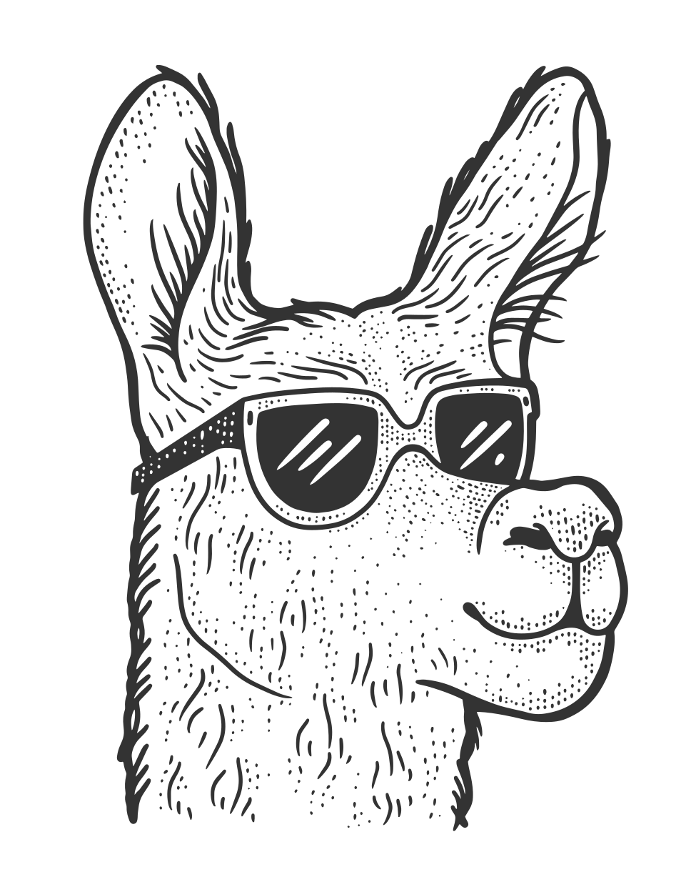
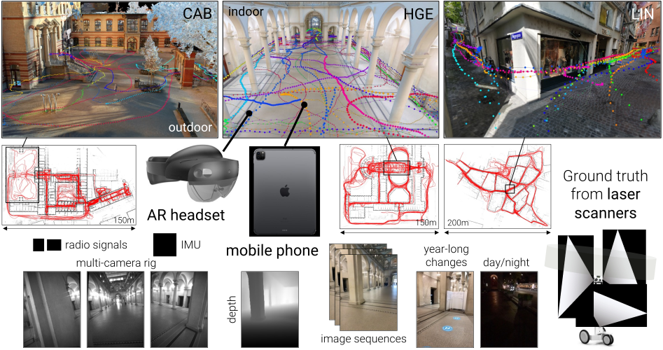

<p align="center">
  <h1 align="center"><br><ins>LaMAR</ins><br>Benchmarking Localization and Mapping<br>for Augmented Reality</h1>
  <p align="center">
    <a href="https://psarlin.com/">Paul-Edouard&nbsp;Sarlin*</a>
    ·
    <a href="https://dsmn.ml/">Mihai&nbsp;Dusmanu*</a>
    <br>
    <a href="https://demuc.de/">Johannes&nbsp;L.&nbsp;Schönberger</a>
    ·
    <a href="https://www.microsoft.com/en-us/research/people/paspecia/">Pablo&nbsp;Speciale</a>
    ·
    <a href="https://www.microsoft.com/en-us/research/people/lugruber/">Lukas&nbsp;Gruber</a>
    ·
    <a href="https://vlarsson.github.io/">Viktor&nbsp;Larsson</a>
    ·
    <a href="http://miksik.co.uk/">Ondrej&nbsp;Miksik</a>
    ·
    <a href="https://www.microsoft.com/en-us/research/people/mapoll/">Marc&nbsp;Pollefeys</a>
  </p>
<p align="center">
    
</p>
  <h2 align="center">ECCV 2022</h2>
  <h3 align="center"><a href="https://lamar.ethz.ch/">Project Page</a> | <a href="https://youtu.be/32XsRli2coo">Video</a></h3>
  <div align="center"></div>
</p>
<p align="center">
    <a href="https://lamar.ethz.ch/"></a>
    <br>
    <em>LaMAR includes multi-sensor streams recorded by AR devices along hundreds of unconstrained trajectories captured over 2&nbsp;years in 3&nbsp;large indoor+outdoor locations.</em>
</p>

##

This repository hosts the source code for LaMAR, a new benchmark for localization and mapping with AR devices in realistic conditions. The contributions of this work are:
1. __A dataset__: multi-sensor data streams captured by AR devices and laser scanners
2. __scantools__: a processing pipeline to register different user sessions together
3. __A benchmark__: a framework to evaluate algorithms for localization and mapping

See our [ECCV 2022 tutorial](https://lamar.ethz.ch/tutorial-eccv2022/) for an overview of LaMAR and of the state of the art of localization and mapping for AR.

## Overview

This codebase is composed of the following modules:

- <a href="#benchmark">`lamar`</a>: evaluation pipeline and baselines for localization and mapping
- <a href="#processing-pipeline">`scantools`</a>: data API, processing tools and pipeline
- [ScanCapture](apps/ScanCapture_iOS): a data recording app for Apple devices

## Data format

We introduce a new data format, called *Capture*, to handle multi-session and multi-sensor data recorded by different devices. A Capture object corresponds to a capture location. It is composed of multiple sessions and each of them corresponds to a data recording by a given device. Each sessions stores the raw sensor data, calibration, poses, and all assets generated during the processing.

```python
from scantools.capture import Capture
capture = Capture.load('data/CAB/')
print(capture.sessions.keys())
session = capture.sessions[session_id]  # each session has a unique id
print(session.sensors.keys())  # each sensor has a unique id
print(session.rigs)  # extrinsic calibration between sensors
keys = session.trajectories.key_pairs()  # all (timestamp, sensor_or_rig_id)
T_w_i = sessions.trajectories[keys[0]]  # first pose, from sensor/rig to world
```

[More details are provided in the specification document `CAPTURE.md`.](./CAPTURE.md)

## Installation

:one: Install the core dependencies:

- Python >= 3.8
- [hloc](https://github.com/cvg/Hierarchical-Localization) and its dependencies, including [COLMAP](https://colmap.github.io/install.html) built from source

:two: Install the LaMAR libraries and pull the remaining pip dependencies:
```bash
python -m pip install -e .
```

:three: Optional: the processing pipeline additionally relies on heavier dependencies not required for benchmarking:

- Pip dependencies: `python -m pip install -e .[scantools]`
- [raybender](https://github.com/cvg/raybender) for raytracing
- [pcdmeshing](https://github.com/cvg/pcdmeshing) for pointcloud meshing

:four: Optional: if you wish to contribute, install the development tools as well:
```bash
python -m pip install -e .[dev]
```

## Benchmark

:one: __Obtain the evaluation data:__ [visit the dataset page](https://lamar.ethz.ch/lamar/) and place the 3 scenes in `./data` :

```
data/
├── CAB/
│   └── sessions/
│       ├── map/                # mapping session
│       ├── query_hololens/     # HoloLens test queries
│       ├── query_phone/        # Phone test queries
│       ├── query_val_hololens/ # HoloLens validation queries
│       └── query_val_phone/    # Phone validation queries
├── HGE
│   └── ...
└── LIN
    └── ...
```

Each scene contains a mapping session and queries for each device type. We provide a small set of validation queries with known ground-truth poses such that they can be used for developing algorithms and tuning parameters. We keep private the ground-truth poses of the test queries.

:two: __Run the single-frame evaluation__ with the strongest baseline:

```bash
python -m lamar.run \
	--scene $SCENE --ref_id map --query_id $QUERY_ID \
	--retrieval fusion --feature superpoint --matcher superglue
```

where `$SCENE` is in `{CAB,HGE,LIN}` and `$QUERY_ID` is in `{query_phone,query_hololens}` for testing and in `{query_val_phone,query_val_hololens}` for validation. All outputs are written to `./outputs/` by default. For example, to localize validation Phone queries in the CAB scene:
```bash
python -m lamar.run \
	--scene CAB --ref_id map --query_id query_val_phone \
	--retrieval fusion --feature superpoint --matcher superglue
```

This executes two steps:
1. Create a sparse 3D map using the mapping session via feature extraction, pair selection, feature matching, triangulation
2. Localize each image of the sequence via feature extraction, pair selection, feature matching, absolute pose estimation

:three: __Obtain the evaluation results:__

- validation queries: the script print the localization recall.
- test queries: until the benchmark leaderboard is up and running, please send the predicted pose files to <a href="&#x6d;ailto&#58;lamar-benchmark&#x40;sympa.ethz.ch">lamar-benchmark&#x40;sympa.ethz.ch</a> :warning: we will only accept at most 2 submissions per user per week.

:four: __Workflow:__ the benchmarking pipeline is designed such that
- the mapping and localization process is split into modular steps listed in [`lamar/tasks/`](./lamar/tasks/)
- outputs like features and matches are cached and re-used over multiple similar runs
- changing a configuration entry automatically triggers the recomputation of all downstream steps that depend on it

#### Other evaluation options

<details>
<summary>[Click to expand]</summary>

Using radio signals for place recognition:
```bash
python -m lamar.run [...] --use_radios
```

Localization with sequences of 10 seconds instead of single images:
```bash
python -m lamar.run [...] --sequence_length_seconds 10
```

</details>

#### Adding your own algorithms

<details>
<summary>[Click to expand]</summary>

To add a new local feature:
- add your feature extractor to hloc in [`hloc/extractors/myfeature.py`](https://github.com/cvg/Hierarchical-Localization/tree/master/hloc/extractors)
- create a configuration entry in [`lamar.tasks.feature_extraction.FeatureExtraction.methods`](./lamar/tasks/feature_extraction.py)

To add a new global feature for image retrieval:
- add your feature extractor to hloc in [`hloc/extractors/myfeature.py`](https://github.com/cvg/Hierarchical-Localization/tree/master/hloc/extractors)
- create a configuration entry in [`lamar.tasks.feature_extraction.RetrievalFeatureExtraction.methods`](./lamar/tasks/feature_extraction.py)

To add a new local feature matcher:
- add your feature matcher to hloc in [`hloc/matchers/mymatcher.py`](https://github.com/cvg/Hierarchical-Localization/tree/master/hloc/matchers)
- create a configuration entry in [`lamar.tasks.feature_matching.RetrievalFeatureMatching.methods`](./lamar/tasks/feature_matching.py)

To add a new pose solver: create a new class that inherits from [`lamar.tasks.pose_estimation.SingleImagePoseEstimation`](./lamar/tasks/pose_estimation.py):

```python
class MyPoseEstimation(SingleImagePoseEstimation):
    method = {'name': 'my_estimator'}
    def run(self, capture):
        ...
```

</details>

## Processing pipeline

Each step of the pipeline corresponds to a runfile in `scantools/run_*.py` that can be used as follow:

- executed from the command line: `python -m scantools.run_phone_to_capture [--args]`
- imported as a library:

```python
from scantools import run_phone_to_capture
run_phone_to_capture.run(...)
```

We provide pipeline scripts that execute all necessary steps:

- [`pipelines/pipeline_scans.py`](pipelines/pipeline_scans.py) aligns multiple NavVis sessions and merge them into a unique reference session
- [`pipelines/pipeline_sequence.py`](pipelines/pipeline_sequence.py) aligns all AR sequences to the reference session

The raw data will be released soon such that anyone is able to run the processing pipeline without access to capture devices.

Here are runfiles that could be handy for importing and exporting data:
- `run_phone_to_capture`: convert a [ScanCapture](apps/ScanCapture_iOS) recording into a Capture session
- `run_navvis_to_capture`: convert a NavVis recording into a Capture Session
- `run_session_to_kapture`: convert a Capture session into a [Kapture](https://github.com/naver/kapture) instance
- `run_capture_to_empty_colmap`: convert a Capture session into an empty [COLMAP model](https://colmap.github.io/format.html#sparse-reconstruction)
- `run_image_anonymization`: anonymize faces and license plates using the [Brighter.AI](https://brighter.ai/) API
- `run_radio_anonymization`: anonymize radio signal IDs
- `run_combine_sequences`: combine multiple sequence sessions into a single session
- `run_qrcode_detection`: detect QR codes in images and store their poses

## Raw data

We also release the raw original data, as recorded by the devices (HoloLens, phones, NavVis scanner), with minimal post-processing.
Like the evaluation data, the raw data is accessed through [the dataset page](https://lamar.ethz.ch/lamar/).
[More details are provided in the specification document `RAW-DATA.md`.](./RAW-DATA.md)

## Release plan

 We are still in the process of fully releasing LaMAR. Here is the release plan:

- [x] LaMAR evaluation data and benchmark
- [x] Ground truthing pipeline
- [x] iOS capture app
- [x] Full raw data
- [ ] Leaderboard and evaluation server
- [ ] 3D dataset viewer

## BibTex citation

Please consider citing our work if you use any code from this repo or ideas presented in the paper:

```
@inproceedings{sarlin2022lamar,
  author    = {Paul-Edouard Sarlin and
               Mihai Dusmanu and
               Johannes L. Schönberger and
               Pablo Speciale and
               Lukas Gruber and
               Viktor Larsson and
               Ondrej Miksik and
               Marc Pollefeys},
  title     = {{LaMAR: Benchmarking Localization and Mapping for Augmented Reality}},
  booktitle = {ECCV},
  year      = {2022},
}
```

## Legal Notices

Microsoft and any contributors grant you a license to the Microsoft documentation and other content
in this repository under the [Creative Commons Attribution 4.0 International Public License](https://creativecommons.org/licenses/by/4.0/legalcode),
see the [LICENSE](LICENSE) file, and grant you a license to any code in the repository under the [MIT License](https://opensource.org/licenses/MIT), see the
[LICENSE-CODE](LICENSE-CODE) file.

Microsoft, Windows, Microsoft Azure and/or other Microsoft products and services referenced in the documentation
may be either trademarks or registered trademarks of Microsoft in the United States and/or other countries.
The licenses for this project do not grant you rights to use any Microsoft names, logos, or trademarks.
Microsoft's general trademark guidelines can be found at http://go.microsoft.com/fwlink/?LinkID=254653.

Privacy information can be found at https://privacy.microsoft.com/en-us/

Microsoft and any contributors reserve all other rights, whether under their respective copyrights, patents,
or trademarks, whether by implication, estoppel or otherwise.
