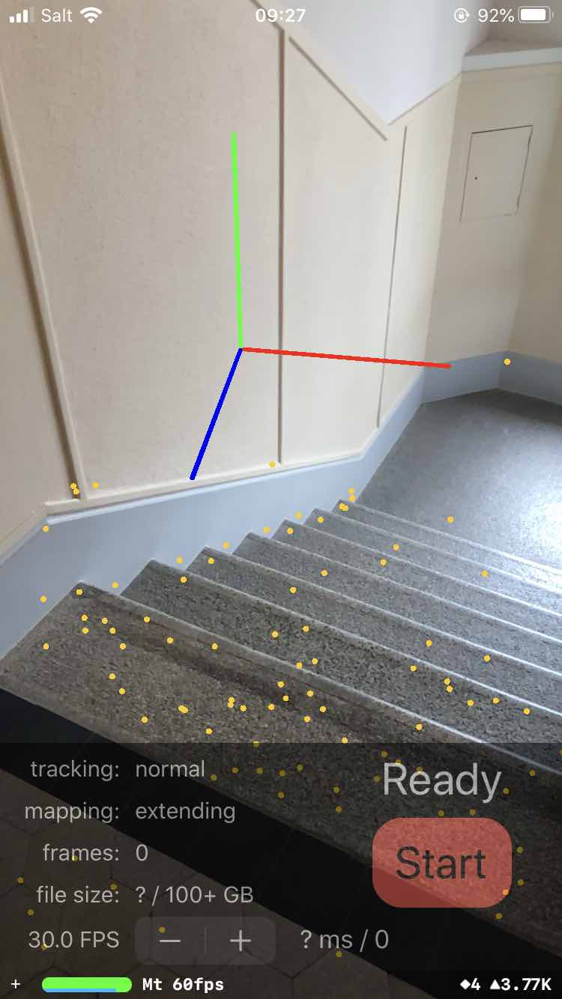
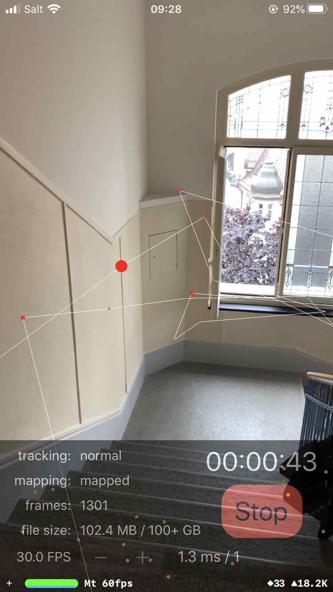
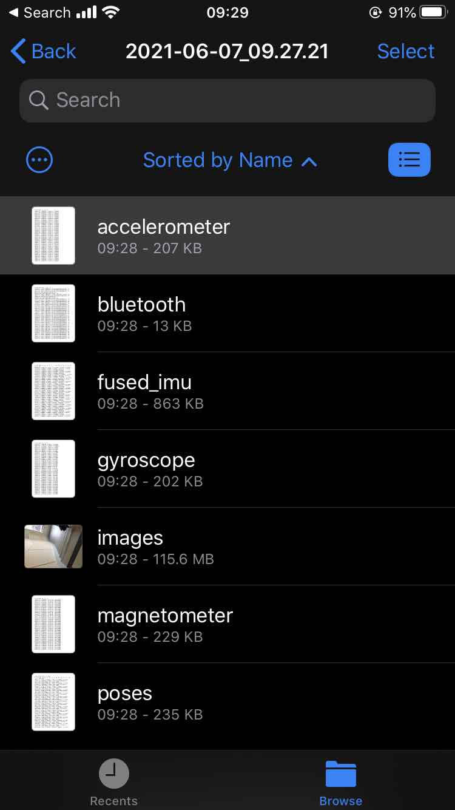

# ScanCapture iOS app

The app can capture the following data:

- images at up to 60 FPS as a compressed video
- ARKit poses and intrinsics for each frame
- raw IMU signals at 100 Hz: accelerometer, gyroscope, magnetometer
- fused IMU signals at 100 Hz: gravity direction, user acceleration, corrected magnetometer
- Bluetooth signals at 1 Hz
- Location data (GPS+wireless)

Other features of the app:

- Visualize the ARKit feature points and the camera trajectory
- Monitor the tracking/mapping status and the size of the recorded data
- Adjust the image framerate from 1 to 60 Hz
- Export the data easily via Airdrop, email, Google Drive, etc.
- Readily visualize the data in the Files app

<p align="center">
  
  
  
</p>


## Build and run

1. Open `ScanCapture.xcodeproj` in Xcode
2. Set your signing team in `Project -> Signing & Capabilities`
3. Connect your device, select it in `Product -> Destination`, and run the application with `Product -> Run`

Tested with Xcode v12.4+ and iOS v13.6+ with iPhone 8 and iPad Pro devices.

## Data format

All timestamps are in microseconds since the boot of the device.

- The images are stored as an MP4 video in `images.mp4`. You can unpack it into individual frames and timestamps with ffmpeg:
  ```
  mkdir ./frames
  ffmpeg -i images.mp4 -vsync 0 -qmin 1 -q:v 1 ./frames/out-%d.jpg
  ffprobe -v quiet -f lavfi -i "movie=images.mp4" -show_entries frame=pkt_pts -of csv=p=0 > timestamps.txt
  ```
  
- The poses are stored in the comma-separated CSV file `poses.txt` in the format:
  -   `timestamp, status, tx, ty, tz, qx, qy, qz, qw, w, h, fx, fy, cx, cy`

- Accelerometer `accelerometer.txt`:

  - `timestamp, ax, ay, az`

- Gyroscope `gyroscope.txt`:

  - `timestamp, rx, ry, rz`

- Magnetometer `magnetometer.txt`:

  - `timestamp, mx, my, mz`

- Fused IMU `fused_imu.txt`:

  - `timestamp, ax, ay, az, rx, ry, rz, mx, my, mz, gx, gy, gz, heading`
  - Here `gx, gy, gz` is the gravity direction and `heading` is the angle in radians w.r.t. the true north.

- Bluetooth in `bluetooth.txt`, if enabled:

  - `timestamp, name, uuid, rssi`
  - The UUID is assigned by iOS and may change if a device goes out of reach. The MAC address is not exposed by iOS.

- Geopositioning in `location.txt`, if enabled:

  - `timestamp, latitude, longitude, altitude-above-sea-level, horizontal-accuracy, vertical-accuracy`
  - The latitude and longitude are the WGS-84 coordinates in decimal degrees and the altitude and accuracies are in meters.
  - We record in maximum accuracy mode, which likely makes use of both GPS and wireless.

## TODO

- [ ] Save optimized anchor poses instead of instantaneous camera poses

